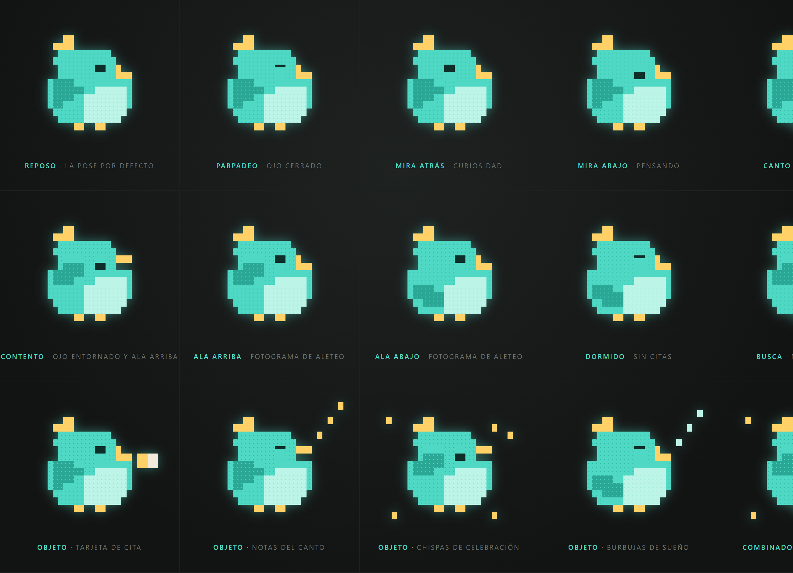

# Taly · la mascota de Citaly

Un pajarito regordete de punto de cruz que trae las citas, avisa cuando toca y
se pone contentísimo al confirmar.



## Qué es y de qué está hecho

Taly se dibuja sobre una rejilla de caracteres de bloque Unicode
(`█ ▀ ▄ ▌ ▐ ▖ ▗ ▘ ▝ ▙ ▟ ▛ ▜`), que es un formato cómodo de leer y de retocar a
mano. Pero **no se pinta como texto, se pinta en SVG**: cada glifo se traduce a
sus rectángulos exactos.

Esto no fue una preferencia estética sino una necesidad. De los 32 caracteres de
bloque, solo 8 tienen el ancho de avance de una celda monoespaciada
(`▀ ▄ █ ▌ ▐ ░ ▒ ▓`). Los cuartos y los tres cuartos miden un 70 % más, porque no
están en las fuentes monoespaciadas habituales y el navegador recurre a otra
fuente. Un solo glifo de esos empuja hacia la derecha todo lo que va detrás en
su fila y descuadra la rejilla entera. En una web es peor aún, porque cada
visitante tiene fuentes distintas y el resultado sería impredecible.
`medir-glifos.mjs` mide esos anchos y deja el problema por escrito.

Pasando a SVG el dibujo sale exacto, nítido a cualquier tamaño, idéntico en
todos los navegadores, y las tramas quedan recortadas a la forma de cada glifo
en vez de desbordarse del contorno.

## Anatomía

| Pieza | Qué es |
| --- | --- |
| `ROWS` | la silueta, que no cambia nunca |
| `COPETE`, `BARRIGA`, `PATAS` | zonas de color dentro de la silueta |
| `OJO`, `PICO`, `ALA` | los tres rasgos que se mueven |
| `POSES` | 10 combinaciones de esos tres rasgos |
| `OBJETOS` | tarjeta, notas, chispas y sueño, fuera del cuerpo |
| `ESCENAS` | 6 bucles de fotogramas con pose, salto vertical y duración |

Las poses son `reposo`, `parpadeo`, `mira-atras`, `mira-abajo`, `canto`,
`contento`, `ala-arriba`, `ala-abajo`, `dormido` y `busca`.

Las escenas son `hero` (presentación), `loader` (cargando), `vacio` (sin citas),
`confirmacion` (cita confirmada), `recordatorio` (te avisa) y `mensajero` (te
trae la cita). Cada una cierra su bucle donde empieza, así que se repite sin
tirón.

## Usar Taly en la app

```jsx
import Taly from '../components/Taly/Taly'

<Taly escena='loader' tamano={28} />
<Taly escena='vacio' tamano={56} />
<Taly escena='confirmacion' tamano={72} brillo />
<Taly pose='dormido' objetos={['sueno']} />   {/* fija, sin animar */}
```

| Prop | Por defecto | Para qué |
| --- | --- | --- |
| `escena` | `'hero'` | cuál de los seis bucles reproduce |
| `pose` | — | si se pasa, manda sobre la escena y Taly se queda quieto |
| `objetos` | — | array de objetos junto a una pose fija |
| `tamano` | `40` | alto de celda en px; el ancho sale de la proporción |
| `brillo` | `false` | halo menta, solo tiene sentido sobre fondo oscuro |
| `animar` | `true` | ponlo a `false` para congelar el primer fotograma |
| `titulo` | — | texto del `aria-label` |

El componente respeta `prefers-reduced-motion`: si el sistema pide menos
movimiento, Taly se queda en el primer fotograma sin que haya que hacer nada.

## Los dos archivos de arte

El dibujo vive por duplicado, porque uno tiene que ser un script clásico que el
navegador cargue desde `file://` y el otro un módulo ES que importe Vite:

- `brand/mascota/taly-arte.js` — el del laboratorio
- `src/components/Taly/arte.js` — el de la app

**Si retocas el dibujo, toca los dos** y comprueba que siguen iguales con
`node paridad.mjs`, que compara rectángulo a rectángulo las diez poses.

## Herramientas

Todas se lanzan desde esta carpeta.

| Comando | Qué hace |
| --- | --- |
| `node verificar.mjs` | audita el arte: glifos válidos, nada fuera de la rejilla, objetos que no tapen el cuerpo, escenas coherentes y bucles que cierran |
| `node paridad.mjs` | comprueba que las dos copias del arte dibujan lo mismo |
| `node render-png.mjs --input X --out Y` | captura un PNG, con `--transparent` para fondo transparente |
| `node medir-glifos.mjs` | mide el ancho de avance de los glifos de bloque por fuente |

Páginas para mirar con el navegador: `taly.html` (una escena o pose, admite
parámetros por URL), `taly-poses.html` (todas las poses), `taly-escenas.html`
(las seis escenas a la vez), `taly-fotogramas.html` (cada escena desglosada
fotograma a fotograma) y `taly-debug.html` (la rejilla con sus coordenadas).

`taly.html` acepta `?escena=`, `?pose=`, `?objetos=`, `?tamano=`, `?fondo=`,
`?fotograma=` y `?brillo=si`.

## Los PNG

En `assets/` hay seis PNG con fondo transparente, a celda de 64 px y escala 3:
`taly`, `taly-contento`, `taly-canto`, `taly-dormido`, `taly-mensajero` y
`taly-busca`. Se regeneran con `render-png.mjs` apuntando a `taly.html` con la
pose que toque.

Salen sin halo a propósito: el brillo quedaría horneado en el archivo y sobre
fondo claro se vería como un cerco sucio. Para el halo está la prop `brillo`,
que lo aplica en vivo con un `drop-shadow`.

## Pendiente: GIF y MP4

Falta `ffmpeg`, que es lo que convierte una secuencia de fotogramas en vídeo.
Para tenerlo:

```powershell
winget install Gyan.FFmpeg
```

Después hay que abrir una terminal nueva para que coja el PATH. Mientras tanto
no hace falta para la web, porque las animaciones las reproduce el componente
React en vivo, que además pesa mucho menos que un GIF y se ve nítido a cualquier
tamaño.
